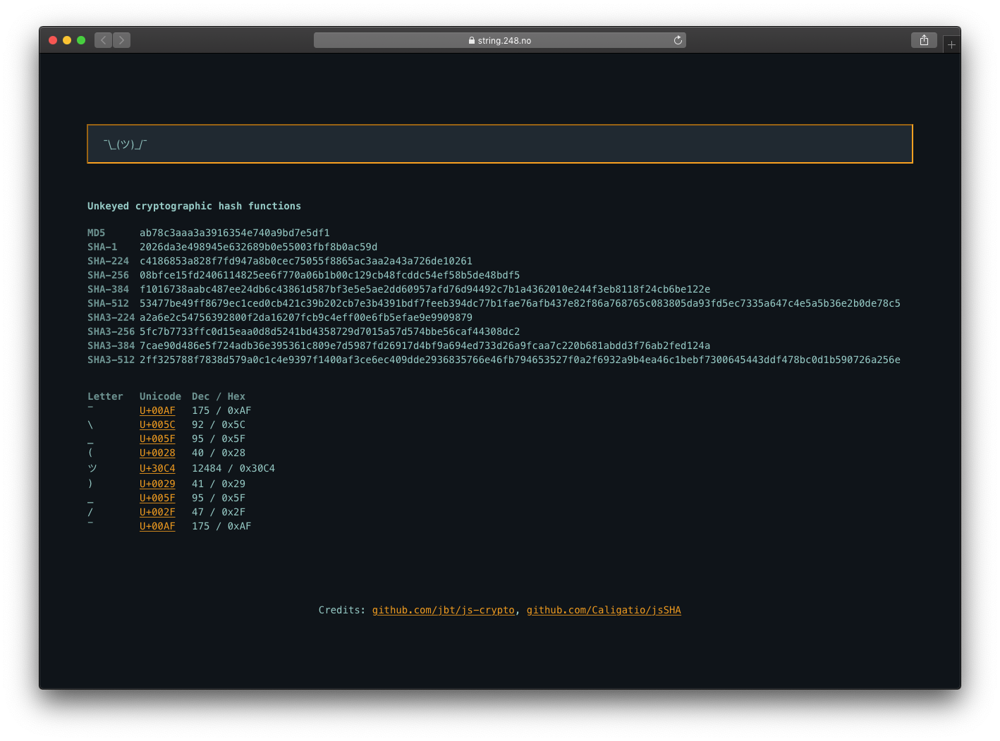

# string.248.no

This is the project files for [string.248.no](https://string.248.no), a static string analyzer on the web.

[](https://string.248.no)

## Installation

The website is avaliable at [string.248.no](https://string.248.no), and the current master branch is present on [rosvik.github.io/string.248.no](https://rosvik.github.io/string.248.no/). 

If you want to run the website on you own, download the project files and run this command to get all dependencies.

```
git submodule update --init --recursive
```

The project is pure static vanilla JS, so open index.html in your favorite browser, and enjoy 🚀

## Submodules

* [js-crypto](https://github.com/jbt/js-crypto) - JavaScript Hash Functions
* [jsSHA](https://github.com/Caligatio/jsSHA) - A pure JS SHA implementation
